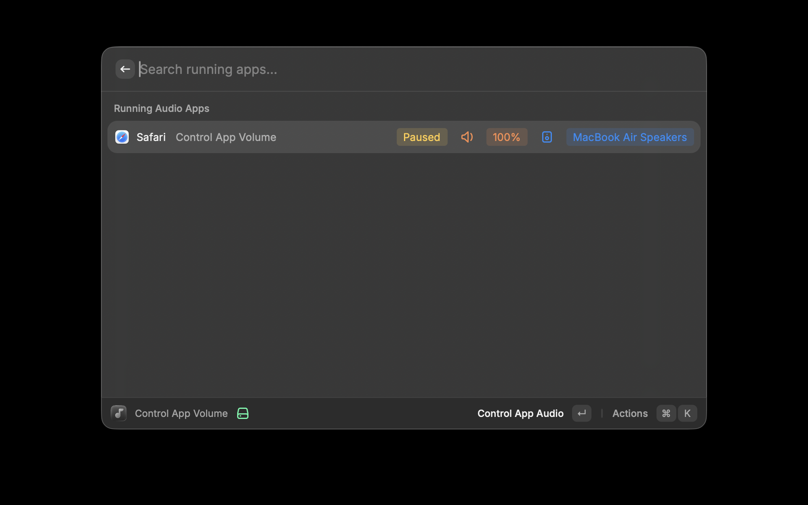
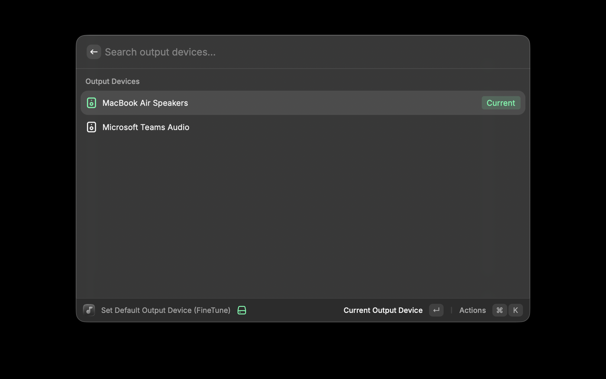

# FineTune for Raycast

FineTune is a Raycast extension for app-level audio control on macOS. The current manifest ships three commands: **Control App Volume**, **Toggle FineTune**, and **Set Default Output Device (FineTune)**.



## Commands

### Control App Volume

Shows apps with active or recent audio and lets you:

- Set per-app volume, including boost presets for supported apps.
- Route an app to a specific output device when FineTune is enabled.
- Remove an existing FineTune route and fall back to the system output device.
- Review current playback state, volume, and routed output from a single list.

### Toggle FineTune

Toggles FineTune processing globally:

- **ON** restores your previous FineTune per-app settings.
- **OFF** stops FineTune-specific routing and volume processing so apps use the system default output.

### Set Default Output Device (FineTune)

Shows the available output devices and lets you switch the macOS default output device directly from Raycast.

This command works through the extension's native CoreAudio integration and does not require the FineTune app to be installed.



## Requirements

- macOS 14.0+ (Sonoma or later)
- Raycast 1.26.0+
- Node.js 22.14+
- FineTune app installed at `/Applications/FineTune.app` for `Toggle FineTune` and FineTune-specific routing or boost flows inside `Control App Volume`

## Installation

```bash
npm install
npm run dev
```

## Notes

- If FineTune is disabled, `Control App Volume` still opens and tracks active apps, but FineTune-specific routing paths stay disabled until you re-enable FineTune.
- If FineTune is not installed, `Toggle FineTune` fails with a clear error message.
- `Set Default Output Device (FineTune)` can still be used even when FineTune is disabled or not installed.

## License

MIT
